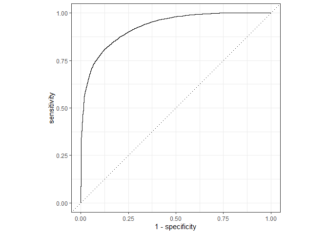

# Análise de clientes: +50k or -50k

``` r
library(tidymodels)
library(ggplot2)
library(skimr)
library(stats)
library(doParallel)
```

``` r
cores = 5
base_adult <- read_rds("data/adult.rds")
```

## Análise exploratória

``` r
questionr::freq.na(base_adult)
#>                missing %
#> occupation        1843 6
#> workclass         1836 6
#> native_country     583 2
#> age                  0 0
#> fnlwgt               0 0
#> education            0 0
#> education_num        0 0
#> marital_status       0 0
#> relationship         0 0
#> race                 0 0
#> sex                  0 0
#> capital_gain         0 0
#> capital_loss         0 0
#> hours_per_week       0 0
#> resposta             0 0
#> id                   0 0

base_adult %>% 
  group_by(workclass, resposta) %>%
  count() %>% 
  arrange(desc(n)) %>% 
  filter(is.na(workclass))
#> # A tibble: 2 x 3
#> # Groups:   workclass, resposta [2]
#>   workclass resposta     n
#>   <chr>     <chr>    <int>
#> 1 <NA>      <=50K     1645
#> 2 <NA>      >50K       191

base_adult %>% 
  group_by(occupation, resposta) %>%
  count() %>% 
  arrange(desc(n)) %>% 
  filter(is.na(occupation))
#> # A tibble: 2 x 3
#> # Groups:   occupation, resposta [2]
#>   occupation resposta     n
#>   <chr>      <chr>    <int>
#> 1 <NA>       <=50K     1652
#> 2 <NA>       >50K       191
```

``` r
base_adult <- base_adult %>%
  tidyr::replace_na(replace = list(native_country = "United-States")) %>%
  tidyr::replace_na(replace = list(workclass = "Private")) %>%
  tidyr::replace_na(replace = list(occupation = "Other-service"))
```

``` r

base_adult$workclass <- as.factor(base_adult$workclass)
base_adult$education <- as.factor(base_adult$education)
base_adult$marital_status <- as.factor(base_adult$marital_status)
base_adult$occupation <- as.factor(base_adult$occupation)
base_adult$relationship <- as.factor(base_adult$relationship)
base_adult$race <- as.factor(base_adult$race)
base_adult$sex <- as.factor(base_adult$sex)

glimpse(base_adult)
#> Rows: 32,561
#> Columns: 16
#> $ age            <dbl> 39, 50, 38, 53, 28, 37, 49, 52, 31, 42, 37, 30, 23, ...
#> $ workclass      <fct> State-gov, Self-emp-not-inc, Private, Private, Priva...
#> $ fnlwgt         <dbl> 77516, 83311, 215646, 234721, 338409, 284582, 160187...
#> $ education      <fct> Bachelors, Bachelors, HS-grad, 11th, Bachelors, Mast...
#> $ education_num  <dbl> 13, 13, 9, 7, 13, 14, 5, 9, 14, 13, 10, 13, 13, 12, ...
#> $ marital_status <fct> Never-married, Married-civ-spouse, Divorced, Married...
#> $ occupation     <fct> Adm-clerical, Exec-managerial, Handlers-cleaners, Ha...
#> $ relationship   <fct> Not-in-family, Husband, Not-in-family, Husband, Wife...
#> $ race           <fct> White, White, White, Black, Black, White, Black, Whi...
#> $ sex            <fct> Male, Male, Male, Male, Female, Female, Female, Male...
#> $ capital_gain   <dbl> 2174, 0, 0, 0, 0, 0, 0, 0, 14084, 5178, 0, 0, 0, 0, ...
#> $ capital_loss   <dbl> 0, 0, 0, 0, 0, 0, 0, 0, 0, 0, 0, 0, 0, 0, 0, 0, 0, 0...
#> $ hours_per_week <dbl> 40, 13, 40, 40, 40, 40, 16, 45, 50, 40, 80, 40, 30, ...
#> $ native_country <chr> "United-States", "United-States", "United-States", "...
#> $ resposta       <chr> "<=50K", "<=50K", "<=50K", "<=50K", "<=50K", "<=50K"...
#> $ id             <int> 1, 2, 3, 4, 5, 6, 7, 8, 9, 10, 11, 12, 13, 14, 15, 1...
```

## ML dividindo a base:

``` r
set.seed(55)
base_adult_split <- initial_split(base_adult %>% select(-id), prop = 0.50)
base_adult_train <- training(base_adult_split)
base_adult_test <- testing(base_adult_split)
```

## Criando a receita

``` r
base_adult_recipe <- recipe(resposta ~ ., base_adult_train) %>%
  step_center(all_numeric()) %>%
  step_scale(all_numeric()) %>%
  step_dummy(all_nominal(), -all_outcomes())
```

## Cross-Validation

``` r
base_adult_resamples <- vfold_cv(base_adult_train, v = 5)
```

## Buscando os melhores hiperparametros para trees() e learn\_rate()

``` r
base_adult_model <- boost_tree(
  mtry = 0.8,
  trees = tune(),
  min_n = 5,
  tree_depth = 4,
  loss_reduction = 0,
  learn_rate = tune(),
  sample_size = 0.8
) %>%
  set_mode("classification") %>%
  set_engine("xgboost", nthread = cores)


base_adult_model
#> Boosted Tree Model Specification (classification)
#> 
#> Main Arguments:
#>   mtry = 0.8
#>   trees = tune()
#>   min_n = 5
#>   tree_depth = 4
#>   learn_rate = tune()
#>   loss_reduction = 0
#>   sample_size = 0.8
#> 
#> Engine-Specific Arguments:
#>   nthread = cores
#> 
#> Computational engine: xgboost


base_adult_wf <- workflow() %>%
  add_model(base_adult_model) %>%
  add_recipe(base_adult_recipe)


base_adult_grid <- expand.grid(
  learn_rate = c(0.05, 0.1, 0.2, 0.3),
  trees = c(100, 250, 500, 1000, 1500, 2000)
)

base_adult_grid
#>    learn_rate trees
#> 1        0.05   100
#> 2        0.10   100
#> 3        0.20   100
#> 4        0.30   100
#> 5        0.05   250
#> 6        0.10   250
#> 7        0.20   250
#> 8        0.30   250
#> 9        0.05   500
#> 10       0.10   500
#> 11       0.20   500
#> 12       0.30   500
#> 13       0.05  1000
#> 14       0.10  1000
#> 15       0.20  1000
#> 16       0.30  1000
#> 17       0.05  1500
#> 18       0.10  1500
#> 19       0.20  1500
#> 20       0.30  1500
#> 21       0.05  2000
#> 22       0.10  2000
#> 23       0.20  2000
#> 24       0.30  2000


base_adult_grid <- base_adult_wf %>%
  tune_grid(
    resamples = base_adult_resamples,
    grid = base_adult_grid,
    control = control_grid(save_pred = TRUE, verbose = FALSE, allow_par = TRUE),
    metrics = metric_set(roc_auc)
  )


autoplot(base_adult_grid)
```


``` r
base_adult_grid %>% show_best(metric = "roc_auc", n = 5)
#> # A tibble: 5 x 8
#>   trees learn_rate .metric .estimator  mean     n std_err .config
#>   <dbl>      <dbl> <chr>   <chr>      <dbl> <int>   <dbl> <chr>  
#> 1   500       0.05 roc_auc binary     0.923     5 0.00245 Model03
#> 2   250       0.1  roc_auc binary     0.923     5 0.00247 Model08
#> 3   100       0.2  roc_auc binary     0.921     5 0.00271 Model13
#> 4   250       0.05 roc_auc binary     0.921     5 0.00293 Model02
#> 5   500       0.1  roc_auc binary     0.921     5 0.00209 Model09
base_adult_select_best_passo1 <- base_adult_grid %>% select_best(metric = "roc_auc")

```

## Buscando os melhores parametros para min\_n() e tree\_depth()

``` r
base_adult_model <- boost_tree(
  mtry = 0.8,
  trees = base_adult_select_best_passo1$trees,
  min_n = tune(),
  tree_depth = tune(),
  loss_reduction = 0,
  learn_rate = base_adult_select_best_passo1$learn_rate,
  sample_size = 0.8
) %>%
  set_mode("classification") %>%
  set_engine("xgboost", nthread = cores)


base_adult_wf <- workflow() %>%
  add_model(base_adult_model) %>%
  add_recipe(base_adult_recipe)


base_adult_grid <- expand.grid(
  tree_depth = c(3, 4, 6, 8, 10),
  min_n = c(5, 15, 30, 60, 90)
)

base_adult_grid <- base_adult_wf %>%
  tune_grid(
    resamples = base_adult_resamples,
    grid = base_adult_grid,
    control = control_grid(save_pred = TRUE, verbose = FALSE, allow_par = TRUE),
    metrics = metric_set(roc_auc)
  )


autoplot(base_adult_grid)
```


``` r
base_adult_grid %>% show_best(metric = "roc_auc", n = 5)
#> # A tibble: 5 x 8
#>   min_n tree_depth .metric .estimator  mean     n std_err .config
#>   <dbl>      <dbl> <chr>   <chr>      <dbl> <int>   <dbl> <chr>  
#> 1     5          4 roc_auc binary     0.923     5 0.00259 Model02
#> 2     5          3 roc_auc binary     0.922     5 0.00272 Model01
#> 3     5          6 roc_auc binary     0.921     5 0.00238 Model03
#> 4    15          4 roc_auc binary     0.919     5 0.00281 Model07
#> 5    15          3 roc_auc binary     0.918     5 0.00298 Model06
base_adult_select_best_passo2 <- base_adult_grid %>% select_best(metric = "roc_auc")

```

\#\#Buscando o melhor parâmetro para loss\_reduction()

``` r
base_adult_model <- boost_tree(
  mtry = 0.8,
  trees = base_adult_select_best_passo1$trees,
  min_n = base_adult_select_best_passo2$min_n,
  tree_depth = base_adult_select_best_passo2$tree_depth,
  loss_reduction = tune(),
  learn_rate = base_adult_select_best_passo1$learn_rate,
  sample_size = 0.8
) %>%
  set_mode("classification") %>%
  set_engine("xgboost", nthread = cores)


base_adult_wf <- workflow() %>%
  add_model(base_adult_model) %>%
  add_recipe(base_adult_recipe)


base_adult_grid <- expand.grid(
  loss_reduction = c(0, 0.05, 0.1, 0.15, 0.25, 0.35, 0.45, 0.5, 1, 2)
)

base_adult_grid <- base_adult_wf %>%
  tune_grid(
    resamples = base_adult_resamples,
    grid = base_adult_grid,
    control = control_grid(save_pred = TRUE, verbose = FALSE, allow_par = TRUE),
    metrics = metric_set(roc_auc)
  )


autoplot(base_adult_grid)
#> Warning: Transformation introduced infinite values in continuous x-axis

#> Warning: Transformation introduced infinite values in continuous x-axis
```


``` r
base_adult_grid %>% show_best(metric = "roc_auc", n = 5)
#> # A tibble: 5 x 7
#>   loss_reduction .metric .estimator  mean     n std_err .config
#>            <dbl> <chr>   <chr>      <dbl> <int>   <dbl> <chr>  
#> 1           0.05 roc_auc binary     0.923     5 0.00262 Model02
#> 2           0.35 roc_auc binary     0.923     5 0.00265 Model06
#> 3           0.15 roc_auc binary     0.923     5 0.00269 Model04
#> 4           0.25 roc_auc binary     0.923     5 0.00258 Model05
#> 5           0.45 roc_auc binary     0.923     5 0.00262 Model07
base_adult_select_best_passo3 <- base_adult_grid %>% select_best(metric = "roc_auc")

```

## Buscando os melhores parâmetros para mtry() e sample\_size()

``` r
base_adult_model <- boost_tree(
  mtry = tune(),
  trees = base_adult_select_best_passo1$trees,
  min_n = base_adult_select_best_passo2$min_n,
  tree_depth = base_adult_select_best_passo2$tree_depth,
  loss_reduction = base_adult_select_best_passo3$loss_reduction,
  learn_rate = base_adult_select_best_passo1$learn_rate,
  sample_size = tune()
) %>%
  set_mode("classification") %>%
  set_engine("xgboost", nthread = cores)


base_adult_wf <- workflow() %>%
  add_model(base_adult_model) %>%
  add_recipe(base_adult_recipe)


base_adult_grid <- expand.grid(
  sample_size = seq(0.5, 1.0, length.out = 10),
  mtry = seq(0.1, 1.0, length.out = 10)
)

base_adult_grid <- base_adult_wf %>%
  tune_grid(
    resamples = base_adult_resamples,
    grid = base_adult_grid,
    control = control_grid(save_pred = TRUE, verbose = FALSE, allow_par = TRUE),
    metrics = metric_set(roc_auc)
  )


autoplot(base_adult_grid)
```


``` r
base_adult_grid %>% show_best(metric = "roc_auc", n = 5)
#> # A tibble: 5 x 8
#>    mtry sample_size .metric .estimator  mean     n std_err .config 
#>   <dbl>       <dbl> <chr>   <chr>      <dbl> <int>   <dbl> <chr>   
#> 1   0.3       1     roc_auc binary     0.924     5 0.00272 Model030
#> 2   0.4       0.944 roc_auc binary     0.924     5 0.00260 Model039
#> 3   0.3       0.833 roc_auc binary     0.924     5 0.00279 Model027
#> 4   0.2       1     roc_auc binary     0.924     5 0.00273 Model020
#> 5   0.5       0.889 roc_auc binary     0.924     5 0.00256 Model048
base_adult_select_best_passo4 <- base_adult_grid %>% select_best(metric = "roc_auc")

```

## Buscando, agora com os outros parâmetros alinhados, os melhores parametros para trees() e lear\_rate()

``` r
base_adult_model <- boost_tree(
  mtry = base_adult_select_best_passo4$mtry,
  trees = tune(),
  min_n = base_adult_select_best_passo2$min_n,
  tree_depth = base_adult_select_best_passo2$tree_depth,
  loss_reduction = base_adult_select_best_passo3$loss_reduction,
  learn_rate = tune(),
  sample_size = base_adult_select_best_passo4$sample_size
) %>%
  set_mode("classification") %>%
  set_engine("xgboost", nthread = cores)


base_adult_wf <- workflow() %>%
  add_model(base_adult_model) %>%
  add_recipe(base_adult_recipe)


base_adult_grid <- expand.grid(
  learn_rate = c(0.0005, 0.001, 0.005, 0.01, 0.05, 0.1, 0.2, 0.3),
  trees = c(100, 250, 500, 1000, 1500, 2000, 3000)
)

base_adult_grid <- base_adult_wf %>%
  tune_grid(
    resamples = base_adult_resamples,
    grid = base_adult_grid,
    control = control_grid(save_pred = TRUE, verbose = FALSE, allow_par = TRUE),
    metrics = metric_set(roc_auc)
  )


autoplot(base_adult_grid)
```


``` r
base_adult_grid %>% show_best(metric = "roc_auc", n = 5)
#> # A tibble: 5 x 8
#>   trees learn_rate .metric .estimator  mean     n std_err .config
#>   <dbl>      <dbl> <chr>   <chr>      <dbl> <int>   <dbl> <chr>  
#> 1  1000       0.05 roc_auc binary     0.924     5 0.00239 Model32
#> 2  3000       0.01 roc_auc binary     0.924     5 0.00269 Model28
#> 3   500       0.05 roc_auc binary     0.924     5 0.00259 Model31
#> 4   250       0.2  roc_auc binary     0.923     5 0.00231 Model44
#> 5   500       0.1  roc_auc binary     0.923     5 0.00241 Model38
base_adult_select_best_passo5 <- base_adult_grid %>% select_best(metric = "roc_auc")

```

# Desempenho final

``` r
base_adult_model <- boost_tree(
  mtry = 0.3,
  trees = 3000,
  min_n = 5,
  tree_depth = 4,
  loss_reduction = 0.05,
  learn_rate = 0.01,
  sample_size = 0.9444444
) %>%
  set_mode("classification") %>%
  set_engine("xgboost", nthread = cores)


base_adult_wf <- workflow() %>%
  add_model(base_adult_model) %>%
  add_recipe(base_adult_recipe)

base_adult_last_fit <- base_adult_wf %>%
  last_fit(
    split = base_adult_split,
    control = control_grid(save_pred = TRUE, verbose = FALSE, allow_par = TRUE),
    metrics = metric_set(roc_auc, f_meas)
  )
#> Warning: The `...` are not used in this function but one or more objects were
#> passed: 'control'
#> ! Resample1: model (predictions): There are new levels in a factor: Holand-Netherlands


collect_metrics(base_adult_last_fit)
#> # A tibble: 2 x 3
#>   .metric .estimator .estimate
#>   <chr>   <chr>          <dbl>
#> 1 f_meas  binary         0.919
#> 2 roc_auc binary         0.927


base_adult_last_fit %>%
  pluck(".workflow", 1) %>%
  pull_workflow_fit() %>%
  vip::vip(num_features = 20)
#> Warning: `as.tibble()` is deprecated as of tibble 2.0.0.
#> Please use `as_tibble()` instead.
#> The signature and semantics have changed, see `?as_tibble`.
#> This warning is displayed once every 8 hours.
#> Call `lifecycle::last_warnings()` to see where this warning was generated.
```


``` r

#### Curva ROC
base_adult_last_fit %>%
  collect_predictions() %>%
  roc_curve(resposta, ".pred_<=50K") %>%
  autoplot()
```


